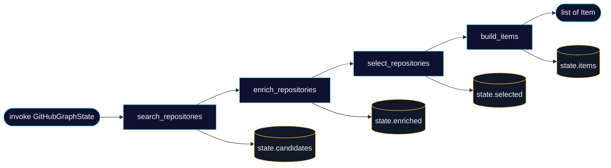
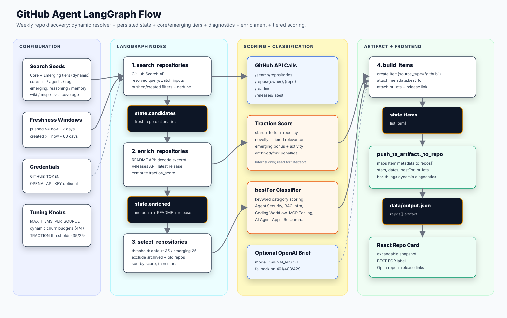
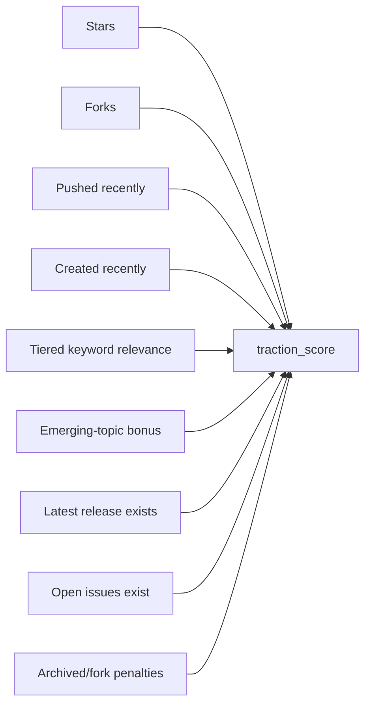
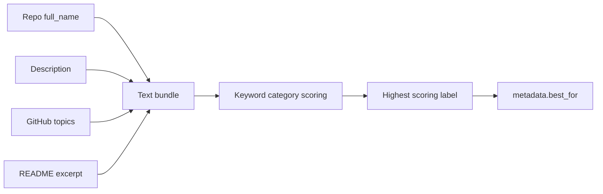
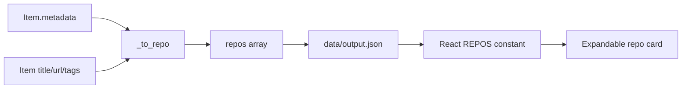
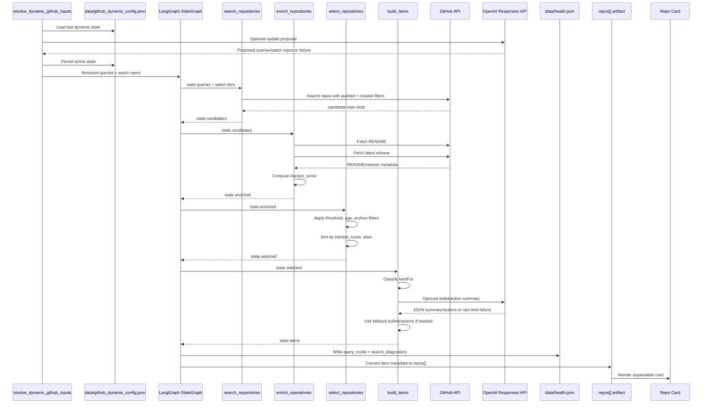

# GitHub Agent Architecture

This page focuses only on the GitHub repository discovery agent.

The agent answers one question for each weekly run:

> Which active AI/LLM repositories are gaining meaningful traction right now, with extra sensitivity to emerging topics?

It uses a two-step runtime flow:

```text
resolve_dynamic_github_inputs -> LangGraph(search -> enrich -> select -> build)
```

LangGraph still runs a fixed line graph:

```text
search_repositories -> enrich_repositories -> select_repositories -> build_items
```

The result is a compact `repos[]` payload for the frontend cards.

## LangGraph Line Graph



The graph state is a typed dictionary:

```python
class GitHubGraphState(TypedDict, total=False):
    queries: list[str]
    repos_evergreen: list[str]
    repos_emerging_watch: list[str]
    dynamic_config: dict[str, Any]
    candidates: list[dict]
    search_diagnostics: dict[str, Any]
    enriched: list[dict]
    selected: list[dict]
    items: list[Item]
```

## Data Flow

The diagram below replaces the compact data-flow chart with a draw.io-style view of configuration, LangGraph nodes, API calls, scoring/classification, artifact mapping, and frontend rendering.



Diagram source: [assets/github-agent-flow.svg](assets/github-agent-flow.svg)

## Dynamic Refresh Layer

Before the graph starts, `resolve_dynamic_github_inputs()` performs runtime resolution:

1. Loads persisted dynamic state from `data/github_dynamic_config.json` when available.
2. Optionally asks OpenAI for a refreshed emerging query/watch proposal.
3. Applies guardrails (sanitization, dedupe, bounded replacements).
4. Persists last-known-good active state for the next run.
5. Returns resolved inputs consumed by `fetch_github_with_graph(...)`.

This keeps the emerging tier fresh while preserving deterministic fallback behavior when LLM proposals fail.

## Node 1: `search_repositories`

Purpose: discover fresh candidate repositories.

Input state:

```python
{
    "queries": resolved_queries,
    "repos_evergreen": resolved_repos_evergreen,
    "repos_emerging_watch": resolved_repos_emerging_watch,
    "dynamic_config": dynamic_refresh_metadata,
}
```

Configured query seeds:

```python
GITHUB_CORE_SEARCH_QUERIES = [
    "topic:llm language:python",
    "topic:agents language:python",
    "topic:rag language:python",
    "topic:generative-ai language:python",
]

GITHUB_EMERGING_SEARCH_QUERIES = [
    "reasoning language:python stars:>30",
    "memory llm language:python stars:>20",
    '"recursive language model" OR rlm language:python stars:>10',
    '"llm wiki" OR "ai wiki" stars:>5',
    "topic:model-context-protocol stars:>10",
    "topic:mcp language:python stars:>10",
    "language:typescript topic:ai stars:>20",
]

GITHUB_SEARCH_QUERIES = (
    GITHUB_CORE_SEARCH_QUERIES + GITHUB_EMERGING_SEARCH_QUERIES
    if GITHUB_ENABLE_EMERGING_QUERIES
    else GITHUB_CORE_SEARCH_QUERIES
)
```

For each query, the node adds time filters:

```text
topic:llm language:python pushed:>=YYYY-MM-DD created:>=YYYY-MM-DD
```

Current defaults:

| Parameter | Default | Env var | Meaning |
| --- | ---: | --- | --- |
| `DATE_WINDOW_DAYS` | `7` | `DATE_WINDOW_DAYS` | repo must have been pushed within the weekly activity window |
| `GITHUB_MAX_REPO_AGE_DAYS` | `60` | `GITHUB_MAX_REPO_AGE_DAYS` | repo must have been created within the recent repo horizon |
| `GITHUB_ENABLE_EMERGING_QUERIES` | `1` | `GITHUB_ENABLE_EMERGING_QUERIES` | include the emerging query tier for wider discovery |
| `GITHUB_SEARCH_PER_QUERY` | `8` | `GITHUB_SEARCH_PER_QUERY` | candidates fetched per query (`per_page`) |
| `sort` | `stars` | — | candidates ordered by GitHub stars within the fresh window |

API used:

```text
GET https://api.github.com/search/repositories?q={query}&sort=stars&order=desc&per_page=8
```

Watched repos (two tiers with distinct age policies):

```python
# Evergreen: established ecosystem anchors.
# Age filter bypassed — included if pushed within DATE_WINDOW_DAYS.
GITHUB_REPOS_EVERGREEN = [
    "openai/openai-python",
    "anthropics/anthropic-sdk-python",
    "anthropics/anthropic-cookbook",
    "langchain-ai/langchain",
    "run-llama/llama_index",
    "microsoft/autogen",
    "crewAIInc/crewAI",
]
# Extend via env: GITHUB_REPOS_EVERGREEN_EXTRA=owner/repo,owner2/repo2

# Emerging: newly relevant projects.
# Normal age filter applies (must be created within GITHUB_MAX_REPO_AGE_DAYS).
GITHUB_REPOS_EMERGING_WATCH = [
    "MemPalace/mempalace",
    "swarmclawai/swarmvault",
]
# Extend via env: GITHUB_REPOS_TO_WATCH_EXTRA=owner/repo,owner2/repo2
```

Evergreen repos appear whenever they were recently active — even if they were created years ago.
Emerging repos must pass the same creation-date cutoff as search results.

Output state:

```python
state["candidates"] = list(unique_repos_by_full_name)
state["search_diagnostics"] = {
    "queries": [{"query": str, "fetched": int, "added": int, "failed": bool}],
    "watch_repos": [{"repo": str, "added": int, "failed": bool, "skipped_old": bool, "kind": "evergreen|emerging"}],
    "pushed_cutoff": "YYYY-MM-DD",
    "created_cutoff": "YYYY-MM-DD",
    "dynamic_config": {"source": "static|persisted|llm", ...},
    "dynamic_refresh": {"updated": bool, "query_rotation": {...}, "watch_rotation": {...}},
    "total_unique_candidates": int,
}
```

Diagnostics are logged at `INFO` level and persisted into `data/health.json` under the `github` source entry alongside a `query_mode` field (`core_only` or `core+emerging`).

## Node 2: `enrich_repositories`

Purpose: gather enough detail to score and summarize each candidate.

For each candidate repo:

```text
GET /repos/{owner}/{repo}/readme
GET /repos/{owner}/{repo}/releases/latest
```

Extraction logic:

| Field | Source | Logic |
| --- | --- | --- |
| `readme_excerpt` | README API | base64 decode README, collapse whitespace, keep first 5000 chars |
| `latest_release` | Releases API | keep release object only if `html_url` exists |
| `traction_score` | local scorer | computed after README and release enrichment |

Release `404` is allowed. Many new repositories do not publish GitHub releases yet.

Output state:

```python
state["enriched"] = [
    {
        ...repo,
        "readme_excerpt": "...",
        "latest_release": {...} or None,
        "traction_score": 0-110,
    }
]
```

## Traction Score

The score is internal. It is used only to filter and sort repositories before writing the frontend artifact.



Scoring formula:

```python
raw = (
    star_score
    + fork_score
    + recency
    + novelty
    + relevance
    + emerging_bonus
    + release_bonus
    + activity
    - penalties
)
traction_score = max(0, min(110, raw))
```

Signal details:

| Signal | Logic | Max / Value |
| --- | --- | ---: |
| `star_score` | `int(log10(max(stars, 1)) * 5)` | `24` |
| `fork_score` | `int(log10(max(forks, 1)) * 3)` | `10` |
| `recency` | pushed in <= 7 days | `20` |
| `recency` | pushed in <= 30 days | `10` |
| `novelty` | created in <= 30 days | `18` |
| `novelty` | created in <= 90 days | `12` |
| `core relevance` | core keyword hits × 5 | — |
| `emerging relevance` | emerging keyword hits × 8 | — |
| `framework relevance` | framework keyword hits × 3 | `40` total cap |
| `emerging_bonus` | 1 emerging keyword hit | `+5` |
| `emerging_bonus` | 2+ emerging keyword hits | `+10` |
| `release_bonus` | latest release exists | `8` |
| `activity` | open issues > 0 | `5` |
| `archived` | penalty | `-35` |
| `fork` | penalty | `-15` |

Note: the `<= 90 days` novelty row is a scoring signal only. The hard repository age filter for selection remains `GITHUB_MAX_REPO_AGE_DAYS` (default `60`).

Keyword taxonomy:

| Tier | Keywords |
| --- | --- |
| Core | llm, language model, agent, agents, agentic, rag, retrieval, generative-ai, generative ai, genai |
| Emerging | reasoning, recursive reasoning, memory, long-term memory, episodic memory, long-context, context-window, extended-context, knowledge-graph, knowledge graph, loop-synthesis, self-improvement, rlm, wiki |
| Framework | langchain, langgraph, llamaindex, model-context-protocol, mcp, autogen, crewai |

The keyword scan runs across:

```text
full_name + description + topics + readme_excerpt
```

## Node 3: `select_repositories`

Purpose: keep only repos that should become dashboard candidates.

Filter rules:

| Rule | Default | Env var |
| --- | --- | --- |
| traction score (standard) | `>= 35` | `TRACTION_THRESHOLD_DEFAULT` |
| traction score (emerging-topic repos) | `>= 25` | `TRACTION_THRESHOLD_EMERGING` |
| archived | must be false | — |
| created date | `>= now - GITHUB_MAX_REPO_AGE_DAYS` | `GITHUB_MAX_REPO_AGE_DAYS` |

A repo is treated as an emerging-topic repo when its combined text scores at least one hit from `EMERGING_AI_KEYWORDS`. These repos qualify at the lower threshold.

Note: `select_repositories` still applies the created-date guard to all selected repos.

Sort order:

1. `traction_score`, descending
2. `stargazers_count`, descending

Output cap:

```python
selected = repos[:MAX_ITEMS_PER_SOURCE]
```

Output state:

```python
state["selected"] = sorted_recent_trending_repos
```

## Node 4: `build_items`

Purpose: convert selected GitHub repo dictionaries into shared pipeline `Item` objects.

This node performs four transformations:

1. deterministic `bestFor` classification
2. optional OpenAI brief generation
3. optional OpenAI recommended-action generation with deterministic fallback
4. `Item` construction with repo-specific metadata

Output state:

```python
state["items"] = list[Item]
```

## Deterministic `bestFor` Classification

The `bestFor` label is deterministic. It does not require OpenAI.



The classifier scores each category by counting whole-keyword hits in the text bundle.
This prevents broad words such as `context` from turning every knowledge or prompt
utility into a RAG infrastructure card. `RAG Infrastructure` is reserved for retrieval,
vector, embedding, reranking, and chunking signals.

| Label | Keywords |
| --- | --- |
| `Agent Security` | security, cyber, threat, malware, incident, red-team, penetration, mitre |
| `MCP Tooling` | mcp, model context protocol, mcp-server, mcp server, tool server |
| `Knowledge Management` | knowledge base, knowledge-base, knowledge graph, knowledge-graph, knowledge hub, wiki, obsidian, pkm, second brain |
| `RAG Infrastructure` | rag, retrieval, vector, vector db, vector database, embedding, rerank, chunking |
| `Coding Workflow` | code, coding, review, developer, devtools, github copilot, cursor, claude code |
| `AI Agent Apps` | agent, agents, multiagent, workflow, automation, skills |
| `Model Serving` | inference, serving, vllm, serverless, gpu, deployment |
| `AI Research` | research, benchmark, evaluation, eval, paper, experiment |
| `Data Extraction` | ocr, scrape, scraping, extract, document, pdf, crawler |
| `Memory & Reasoning` | memory, long-term memory, episodic memory, reasoning, recursive reasoning, long-context, context-window, rlm, loop-synthesis, self-improvement |
| `AI Engineering` | fallback when no category has hits |

This label is displayed at the bottom of the expanded repo card.

## Optional OpenAI Brief And Actions

OpenAI is used only to improve visible repo bullets and recommended actions. It
is not required for searching, filtering, scoring, or classification.

Model:

```text
OPENAI_MODEL or gpt-5.4-mini
```

Prompt input:

```json
{
  "repo": "owner/repo",
  "description": "...",
  "language": "Python",
  "topics": ["agents", "rag"],
  "stars": 1234,
  "pushed_at": "2026-05-15T00:00:00Z",
  "latest_release": "v1.2.0",
  "latest_release_url": "https://github.com/owner/repo/releases/tag/v1.2.0",
  "license": "Apache-2.0",
  "readme_excerpt": "first 2500 chars"
}
```

Stats behavior:

- `REPOS INDEXED`: total selected GitHub pool (`MAX_ITEMS_PER_SOURCE` cap).
- `repos[]`: top 8 displayed cards.
- The stats tile sublabel is emitted as `8 shown` (or fewer when less data is available).

Expected model output:

```json
{
  "desc": "Compact description",
  "bullets": ["...", "...", "..."],
  "whyTrending": "...",
  "actionItems": ["...", "...", "..."]
}
```

Fallback behavior:

- If `OPENAI_API_KEY` is missing, use deterministic bullets and three
  deterministic repo actions.
- If OpenAI returns `401`, `403`, or `429`, disable OpenAI calls for the rest of the run.
- `OPENAI_REPO_BRIEF_LIMIT` caps combined bullet/action attempts per run.

The frontend does not currently display `whyTrending`.

## Item Metadata

`build_items` emits `Item` objects with GitHub-specific metadata:

```python
metadata = {
    "item_kind": "repo",
    "stars": int,
    "forks": int,
    "watchers": int,
    "open_issues": int,
    "language": str,
    "homepage": str,
    "license": str,
    "created_at": str,
    "updated_at": str,
    "pushed_at": str,
    "fetched_at": str,
    "trend_window_days": int,
    "max_repo_age_days": int,
    "latest_release": str,
    "latest_release_url": str,
    "best_for": str,
    "traction_score": int,
    "bullets": list[str],
    "action_items": list[str],
}
```

Some metadata is internal and kept for sorting/debugging. `push_to_artifact.py` chooses what becomes frontend-visible.

## Frontend Artifact Mapping

`push_to_artifact.py` maps each GitHub `Item` into `data/output.json`.



Frontend-facing repo shape:

```json
{
  "name": "owner/repo",
  "stars": "6.3k",
  "desc": "Short repository description",
  "url": "https://github.com/owner/repo",
  "language": "Python",
  "topics": ["agents", "rag"],
  "createdAt": "Feb 25, 2026",
  "lastUpdated": "May 13, 2026",
  "fetchedAt": "May 15, 2026",
  "bestFor": "Agent Security",
  "bullets": [
    "What the repo does.",
    "What stack or topics it uses.",
    "Why it appears actively maintained."
  ],
  "actionItems": [
    "Clone and run the README quickstart.",
    "Map one workflow to the repo APIs.",
    "Review release, issues, and license before a pilot."
  ],
  "latestRelease": "v1.2.0",
  "latestReleaseUrl": "https://github.com/owner/repo/releases/tag/v1.2.0",
  "homepage": "https://example.com",
  "license": "Apache-2.0"
}
```

The dashboard card shows:

- repo name
- updated date
- description
- stars
- language
- created date
- license
- three bullets
- `BEST FOR` label
- `RECOMMENDED ACTIONS` panel with exactly three repo experiment pointers
- blue rectangular release link, when available
- gold rectangular open repo link

## End-To-End GitHub Agent Sequence



## Tuning Points

| Setting | Why change it |
| --- | --- |
| `GITHUB_SEARCH_QUERIES` | Adjust topical coverage. |
| `GITHUB_SEARCH_PER_QUERY` | Increase or reduce per-query candidate breadth. |
| `GITHUB_DYNAMIC_AUTO_UPDATE` | Enable/disable auto-refresh of emerging query/watch tiers each run. |
| `GITHUB_DYNAMIC_MAX_QUERY_REPLACEMENTS` | Limit emerging query churn per run. |
| `GITHUB_DYNAMIC_MAX_WATCH_REPLACEMENTS` | Limit emerging watchlist churn per run. |
| `GITHUB_DYNAMIC_MAX_EMERGING_QUERIES` | Cap active emerging query count. |
| `GITHUB_DYNAMIC_MAX_EMERGING_WATCH` | Cap active emerging watch repo count. |
| `DATE_WINDOW_DAYS` | Expand or narrow weekly activity freshness. |
| `GITHUB_MAX_REPO_AGE_DAYS` | Make repo discovery stricter or looser on newness. |
| `GITHUB_ENABLE_EMERGING_QUERIES` | Run core-only mode or core+emerging mode. |
| `TRACTION_THRESHOLD_DEFAULT` | Tighten/relax standard repo selection. |
| `TRACTION_THRESHOLD_EMERGING` | Tighten/relax early emerging repo selection. |
| `MAX_ITEMS_PER_SOURCE` | Increase or reduce candidate volume. |
| `OPENAI_REPO_BRIEF_LIMIT` | Control OpenAI cost/rate-limit exposure. |
| `GITHUB_REPOS_EVERGREEN_EXTRA` | Extend evergreen watch coverage. |
| `GITHUB_REPOS_TO_WATCH_EXTRA` | Extend emerging watch coverage. |
| best-for keyword table | Improve deterministic category labels. |

## Current Design Choice

The UI intentionally hides internal scores and threshold explanations. The agent uses those values to decide what appears, but the frontend shows only human-readable snapshot fields.
