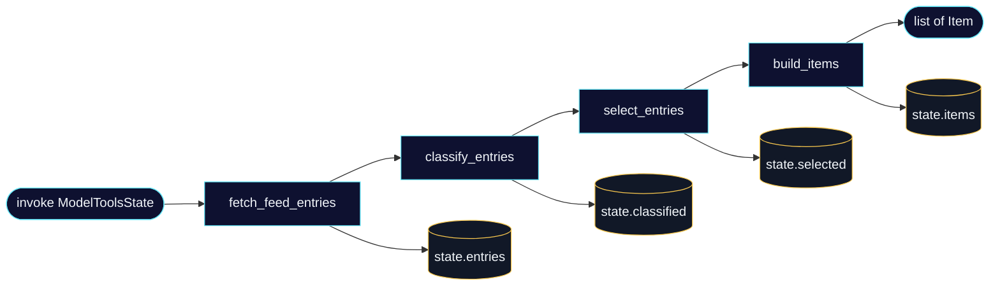
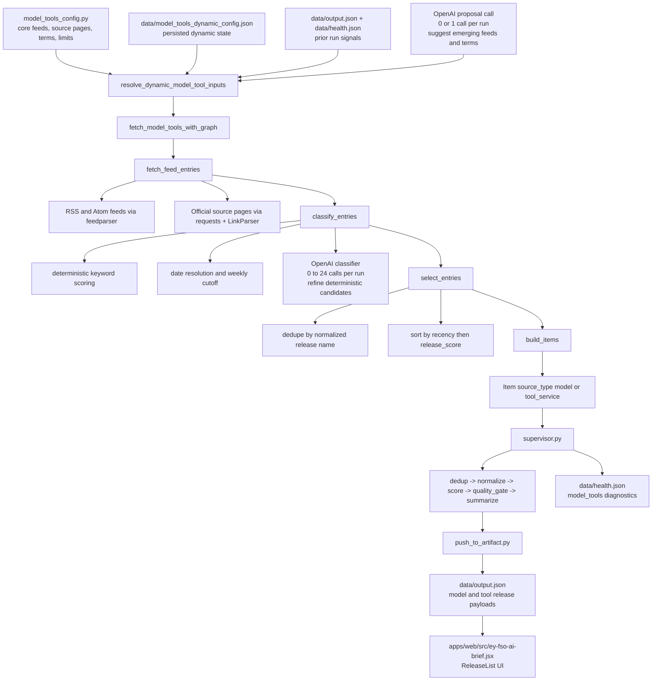

# Model and Tools Agent Architecture

This page focuses only on the model release and AI tool/service discovery agent.

The agent answers one question for each weekly run:

> Which model launches and AI tool/service announcements are recent enough, specific enough, and structured enough to show as weekly dashboard cards?

It uses a two-step runtime flow:

```text
resolve_dynamic_model_tool_inputs -> LangGraph(fetch_feed_entries -> classify_entries -> select_entries -> build_items)
```

LangGraph still runs as a fixed line graph:

```text
fetch_feed_entries -> classify_entries -> select_entries -> build_items
```

The result is a compact `models[]` and `toolsServices[]` payload for the frontend cards.

## LangGraph Line Graph



The graph state is a typed dictionary:

```python
class ModelToolsState(TypedDict, total=False):
    feeds: list[str]
    source_pages: list[str]
    model_terms: list[str]
    tool_terms: list[str]
    dynamic_config: dict[str, Any]
    entries: list[dict[str, Any]]
    classified: list[dict[str, Any]]
    selected: list[dict[str, Any]]
    items: list[Item]
```

## End-to-End Data Flow



## Configuration Map

The human-maintained configuration home is
`apps/pipeline/src/news_pipeline/model_tools_config.py`. Start there when
changing model/tools discovery:

| Location | Role | Edit directly? |
| --- | --- | --- |
| `model_tools_config.py` | static source groups, core terms, toggles, and limits | yes |
| `.env` | local operational overrides | yes, locally only |
| `data/model_tools_dynamic_config.json` | generated last-known-good emerging state | inspect only |
| `data/health.json` | runtime diagnostics for the latest pipeline run | inspect only |

Use this vocabulary consistently:

- **Core feeds** are protected RSS sources that are always active.
- **Emerging feeds** are the bounded rotating feed set that supplements core feeds.
- **Candidate feeds** are the allow-list from which LLM proposals may choose emerging feeds.
- **Source pages** are official non-RSS fallback pages.
- **Core terms** are deterministic classifier inputs stored in Python.
- **Emerging terms** are generated model and tool/service terms stored in runtime state.

Normal runs fetch the deduplicated combination of core feeds and active emerging
feeds. `data/model_tools_dynamic_config.json` is generated by the pipeline for
inspection and continuity; it is not the primary contributor edit point.

## Dynamic Refresh Layer

Before the graph starts, `resolve_dynamic_model_tool_inputs()` performs runtime resolution:

1. Loads persisted state from `data/model_tools_dynamic_config.json` when available.
2. Builds the active source set from protected core feeds, bounded emerging feeds, and official source pages.
3. Optionally asks OpenAI for refreshed emerging feeds and keyword terms.
4. Applies guardrails: feed allow-list validation, term sanitization, dedupe, and bounded replacements.
5. Persists the last-known-good active state for the next run.
6. Returns resolved inputs plus diagnostic metadata consumed by `fetch_model_tools_with_graph(...)`.

This keeps discovery fresh without letting the LLM fully own the source list or classification rules.

Collection bounds and controls:

| Collection or control | Default | Env var | Meaning |
| --- | ---: | --- | --- |
| Core feeds | `14` static defaults | `MODEL_TOOL_CORE_FEEDS` | always active; override replaces the complete list |
| Source pages | `6` static defaults | `MODEL_TOOL_SOURCE_PAGES_EXTRA` | official fallback pages; extras are additive |
| Candidate feeds | derived allow-list | `MODEL_TOOL_EMERGING_FEEDS_EXTRA` | allowed proposal pool; extras also become candidates |
| Emerging feeds | max `5` active | `MODEL_TOOL_DYNAMIC_MAX_EMERGING_FEEDS` | rotating feed set |
| Emerging model terms | max `12` active | `MODEL_TOOL_DYNAMIC_MAX_EMERGING_TERMS` | rotating model-term set |
| Emerging tool/service terms | max `12` active | `MODEL_TOOL_DYNAMIC_MAX_EMERGING_TERMS` | rotating tool-term set |
| Emerging feed swaps | max `2` per run | `MODEL_TOOL_DYNAMIC_MAX_FEED_REPLACEMENTS` | bounded feed rotation |
| Emerging term swaps | max `4` per set per run | `MODEL_TOOL_DYNAMIC_MAX_TERM_REPLACEMENTS` | bounded term rotation |
| Rendered model cards | max `8` | `MODEL_TOOL_MAX_ITEMS` | shared graph-selection and dashboard cap |
| Rendered tool/service cards | max `8` | `MODEL_TOOL_MAX_ITEMS` | shared graph-selection and dashboard cap |
| LLM classifications | max `24` per run | `MODEL_TOOL_LLM_CLASSIFY_LIMIT` | bounded candidate refinement |

`MODEL_TOOL_DYNAMIC_AUTO_UPDATE=1` enables bounded LLM proposals.
`MODEL_TOOL_LLM_CLASSIFY=1` enables bounded classification refinement. Static
core feeds, source pages, candidate feeds, and core terms are list-owned rather
than runtime-capped.

Source groups in `model_tools_config.py`:

- `MODEL_TOOL_CORE_FEEDS`: stable RSS sources that always stay active.
- `MODEL_TOOL_EMERGING_FEEDS`: rotating feed layer controlled by bounded refresh logic.
- `MODEL_TOOL_SOURCE_PAGES`: official vendor pages used when RSS is unavailable or too sparse.
- `MODEL_TOOL_FEED_CANDIDATES`: allow-list from which LLM proposals must choose.

## Where OpenAI Is Used

OpenAI is optional and appears at two separate points. The deterministic
pipeline continues when no API key is configured or when an OpenAI call fails.

| LLM path | When it runs | Calls per pipeline run | What it does | What limits it |
| --- | --- | ---: | --- | --- |
| Emerging-source proposal | before feed fetching | `0` or `1` | suggests the next bounded emerging feed and term rotation | rotation caps, not the `24` classification cap |
| Candidate classification refinement | after deterministic classification | `0` to `24` | reviews individual release candidates and may suppress, reclassify, or improve card fields | `MODEL_TOOL_LLM_CLASSIFY_LIMIT=24` |

### 1. Emerging-source proposal

`resolve_dynamic_model_tool_inputs()` makes at most one proposal call through
`_call_llm_for_proposal(...)` when `MODEL_TOOL_DYNAMIC_AUTO_UPDATE=1`.

The prompt includes:

- protected core feeds
- the candidate-feed allow-list
- currently active emerging feeds
- currently active emerging model and tool/service terms
- recent model/tools cards and health signals from the prior run
- maximum active items and maximum replacements per run

The response must be JSON with:

```json
{
  "emerging_feeds": [],
  "emerging_model_terms": [],
  "emerging_tool_terms": []
}
```

The LLM cannot remove protected core feeds. Proposed feeds must exactly match
the candidate allow-list. The resolver sanitizes and deduplicates the response,
then applies the configured rotation bounds:

- at most `5` active emerging feeds
- at most `2` emerging-feed swaps per run
- at most `12` active emerging model terms
- at most `12` active emerging tool/service terms
- at most `4` term swaps per set per run

This proposal path is one pipeline-tuning call. It is not limited by
`MODEL_TOOL_LLM_CLASSIFY_LIMIT`.

### 2. Candidate classification refinement

After date resolution and deterministic keyword scoring, `_classify_entries()`
calls `_openai_classify_entry(...)` only for candidates that already passed the
deterministic classifier. Each call receives one candidate:

- title, source, URL, and resolved publish date
- up to `1800` characters of article content
- the deterministic `kind`, `name`, `org`, `tag`, and `note`

The response must be JSON with:

```json
{
  "include": true,
  "kind": "model",
  "name": "Example Model",
  "org": "Example Org",
  "note": "One dashboard-ready sentence.",
  "tag": "MODEL",
  "confidence": 0.9
}
```

This is where the `24` default applies. `MODEL_TOOL_LLM_CLASSIFY_LIMIT=24`
means the pipeline may make at most `24` per-candidate classification calls in
one model/tools run. It does not mean `24` proposals, feeds, terms, or output
cards. After the cap is reached, remaining deterministic candidates continue
without LLM refinement.

The LLM result replaces the deterministic result only when `include=true`,
`confidence >= 0.7`, and `kind` is `model` or `tool_service`. Otherwise the
candidate is suppressed. If the API key is missing or a call fails,
deterministic classification remains the fallback. Quota or authentication
failures disable further classifier calls for the rest of that run.

## Node 1: `fetch_feed_entries`

Purpose: collect raw release candidates from RSS/Atom feeds and official source pages.

Input state:

```python
{
    "feeds": resolved_feeds,
    "source_pages": resolved_source_pages,
    "model_terms": resolved_emerging_model_terms,
    "tool_terms": resolved_emerging_tool_terms,
    "dynamic_config": dynamic_refresh_metadata,
}
```

Current source families:

- OpenAI news and developer feeds
- Hugging Face blog
- Google research, developer, AI, and cloud feeds
- Microsoft research, AI, and Azure feeds
- NVIDIA and AWS ML feeds
- Official source pages for Anthropic, Gemini changelog, Meta AI, Mistral, and Cohere

RSS handling:

- Parsed with `feedparser`
- Reads `published_parsed` or `updated_parsed` when present
- Drops feed entries older than `window_start()` when a structured date exists
- Normalizes entry content via HTML stripping and whitespace collapse

Source-page handling:

- Fetched with `requests`
- Parsed with a small `LinkParser`
- Collects candidate links, title text, page descriptions, and paragraph text
- Filters links by host match, path relevance, and title quality
- Seeds initial `published_date` from title text when a visible date exists

Output state:

```python
state["entries"] = [
    {
        "source": str,
        "title": str,
        "url": str,
        "published_date": str,
        "content": str,
        "source_url": str,
        "source_label": "RSS feed" | "Source page",
        "source_page": bool,
    }
]
```

## Date Resolution and Weekly Boundary

The model/tools workflow is stricter than generic RSS ingestion because card filtering depends on trustworthy release dates.

Structured date resolution order:

1. Feed timestamps from `published_parsed` or `updated_parsed`
2. Existing `published_date` already attached to the candidate
3. HTML metadata on article pages such as `article:published_time`, `datePublished`, `dateModified`, or `<time datetime=...>`
4. Visible text dates such as `May 28, 2026`
5. Date-like URL paths such as `/2026/05/28/...`
6. Fallback `Last-Modified` response header

Rules:

- If the agent resolves a publish date and it is older than `window_start()`, the candidate is dropped.
- If the agent cannot resolve a recent publish date at all, the candidate is dropped.
- This intentionally favors fewer correct weekly cards over more noisy cards with `Unknown` or stale dates.

Current weekly window control:

| Parameter | Default | Env var | Meaning |
| --- | ---: | --- | --- |
| `DATE_WINDOW_DAYS` | `7` | `DATE_WINDOW_DAYS` | publish-date lower bound for eligible model/tool cards |

## Node 2: `classify_entries`

Purpose: turn raw candidates into release-specific model or tool/service records.

The classifier is deterministic-first.

Signal groups:

- `MODEL_TOOL_CORE_MODEL_TERMS`: vendor/model-family words such as `claude`, `gemini`, `llama`, `mistral`, `embedding`, `tts`
- `MODEL_TOOL_CORE_TOOL_SERVICE_TERMS`: agent/tool/platform words such as `codex`, `sdk`, `agent development kit`, `cli`, `copilot`, `platform`
- `MODEL_TOOL_RELEASE_TERMS`: launch cues such as `announcing`, `released`, `available`, `preview`, `beta`, `changelog`

High-level logic:

1. Score title matches more heavily than body text.
2. Require release language plus a product-focused headline. Reject tutorials, guides,
   case studies, customer stories, and implementation advice unless the headline clearly
   announces a concrete shipped release.
3. Choose `kind = model` or `kind = tool_service` based on the stronger score.
4. Derive presentation fields:
   - `name`: cleaned title without generic prefixes
   - `org`: inferred from source host and content hints
   - `note`: first one to two specific sentences from the article content
   - `tag`: normalized model/tool display tag such as `API`, `OPEN`, `CLI`, `PLATFORM`
5. For source-page candidates with thin content, fetch the article page again and enrich the excerpt before reclassifying.

Output state:

```python
state["classified"] = [
    {
        ...entry,
        "kind": "model" | "tool_service",
        "name": str,
        "org": str,
        "note": str,
        "tag": str,
        "release_score": int,
        "classifier": "deterministic" | "llm",
        "llm_confidence": float | None,
    }
]
```

## Optional LLM Classification

OpenAI can refine candidate classification when enabled.

Purpose:

- suppress false positives that deterministic keyword rules still admit
- improve card naming and note quality for ambiguous release pages
- keep output within a narrow schema instead of producing free-form summaries

Guardrails:

- disabled entirely when `OPENAI_API_KEY` is absent
- disabled for the rest of the run after quota/auth failures
- bounded by `MODEL_TOOL_LLM_CLASSIFY_LIMIT`, which applies only to per-entry classification calls
- deterministic classification remains the fallback when the call fails
- LLM output must meet confidence and schema checks before it replaces the deterministic version

Control:

| Parameter | Default | Env var | Meaning |
| --- | ---: | --- | --- |
| `MODEL_TOOL_LLM_CLASSIFY` | `1` | `MODEL_TOOL_LLM_CLASSIFY` | enable LLM classification refinement |
| `MODEL_TOOL_LLM_CLASSIFY_LIMIT` | `24` | `MODEL_TOOL_LLM_CLASSIFY_LIMIT` | cap per-entry LLM classification calls per run; does not limit the proposal call |
| `OPENAI_MODEL` | `gpt-5.4-mini` | `OPENAI_MODEL` | model used for dynamic proposals and release classification |

## Node 3: `select_entries`

Purpose: keep only the most useful weekly cards per category.

Selection rules:

1. Split classified entries into `model` and `tool_service`.
2. Sort each group by:
   - resolved `published_date` descending
   - `release_score` descending
3. Deduplicate by normalized release name.
4. Collapse same-organization, same-kind, same-day near-duplicate product names while
   preserving distinct version announcements.
5. Keep up to `MODEL_TOOL_MAX_ITEMS` per category.

This means recency is the primary weekly ranking signal once the item is trusted enough to classify.

Control:

| Parameter | Default | Env var | Meaning |
| --- | ---: | --- | --- |
| `MODEL_TOOL_MAX_ITEMS` | `8` | `MODEL_TOOL_MAX_ITEMS` | max selected cards per category |

Output state:

```python
state["selected"] = [classified_entry, ...]
```

## Node 4: `build_items`

Purpose: convert selected release entries into pipeline `Item` objects.

Generated item shape:

```python
Item(
    id=f"{kind}-{stable_hash(url)}",
    source=org,
    source_type="model" | "tool_service",
    title=name,
    url=url,
    authors=[org],
    published_date=resolved_iso_date,
    fetched_date=utc_now_iso(),
    raw_content=note,
    tags=[tag.lower(), kind.replace("_", "-")],
    related_links=[source_url] if source_url and source_url != url else [],
    metadata={
        "item_kind": kind,
        "name": name,
        "org": org,
        "note": note,
        "tag": tag,
        "source_feed": source,
        "source_url": source_url,
        "source_label": source_label,
        "release_score": release_score,
        "classifier": classifier,
        "llm_confidence": llm_confidence,
    },
)
```

These items then re-enter the shared pipeline with the other source types.

## Supervisor Integration

The model/tools workflow is one fetch agent inside the main supervisor fan-out.

```python
FETCH_AGENTS = {
    "papers": fetch_papers,
    "github": fetch_github,
    "rss": fetch_rss,
    "model_tools": fetch_model_tools,
}
```

Runtime sequence:

1. `supervisor.py` runs all fetch agents in parallel.
2. `fetch_model_tools()` returns `Item` objects from the graph.
3. Supervisor appends model/tools diagnostics into the `health` entry for `source = model_tools`.
4. The shared pipeline continues through:
   - `deduplicate_items(...)`
   - `normalize_items(...)`
   - `score_items(...)`
   - `apply_quality_gate(...)`
   - `summarize_items(...)`
5. `push_to_artifact(...)` writes the final dashboard payload.

## Artifact Mapping

The frontend does not read raw `Item` objects. It reads the release-card shape emitted by `push_to_artifact.py`.

Mapping function:

```python
def _to_release(item: dict) -> dict:
    return {
        "name": metadata.get("name") or item.get("title", "Untitled"),
        "org": metadata.get("org") or item.get("source", "AI"),
        "date": _format_date(item.get("published_date", "")),
        "note": metadata.get("note") or ...,
        "tag": metadata.get("tag") or ...,
        "url": release_url,
        "sourceUrl": source_url,
        "sourceLabel": metadata.get("source_label", "Source"),
        "links": [
            {"label": "Read release", "url": release_url},
            {"label": source_label, "url": source_url},
        ],
    }
```

Final artifact fields:

- `models`: first `MODEL_TOOL_MAX_ITEMS` `source_type == "model"` items mapped through `_to_release(...)`
- `toolsServices`: first `MODEL_TOOL_MAX_ITEMS` `source_type == "tool_service"` items mapped through `_to_release(...)`

Because stale or undated entries are filtered before artifact generation, the dashboard cards should not require frontend-side date repair.

## Frontend Rendering

The dashboard consumes `pipelineData.models` and `pipelineData.toolsServices` in `apps/web/src/ey-fso-ai-brief.jsx`.

Current UI behavior:

- both sections use the shared `ReleaseList` component
- rows are collapsed by default, matching the repo-list interaction style
- clicking a row expands it to show:
  - organization tag
  - resolved date tag
  - type tag
  - longer summary note
  - release/source links

This keeps the Releases drill-down compact while preserving access to the underlying source material.

## Diagnostics and Health Output

After each run, supervisor stores model/tools diagnostics in `data/health.json` under `source = "model_tools"`.

Current diagnostic shape:

```python
{
    "feeds_requested": int,
    "source_pages_requested": int,
    "entries_fetched": int,
    "classified": int,
    "selected": int,
    "llm_classification_attempts": int,
    "llm_classification_failures": int,
    "llm_classification_disabled": bool,
    "llm_classification_skip_reason": str,
    "classification_diagnostics": {...},
    "selection_diagnostics": {
        "rejected_near_duplicate": int,
    },
    "dynamic_config": {...},
}
```

Health entries also include:

- `status`
- `item_count`
- `duration_ms`
- `dynamic_config`
- `extraction_diagnostics`

This is the main place to inspect why the weekly model/tool count changed across runs.

## Failure Modes and Guardrails

Common failure cases and how the workflow handles them:

| Failure mode | Handling |
| --- | --- |
| RSS feed missing timestamps | fallback date extraction from article/page content |
| Official source page is noisy | URL/title filters and article excerpt re-fetch before classification |
| OpenAI unavailable or over quota | deterministic behavior continues; diagnostics capture the reason |
| Candidate has no trustworthy recent date | card is dropped before selection |
| Duplicate vendor announcements across feeds/pages | dedupe by normalized release name during selection |
| Generic vendor marketing pages | release-term and focus-term thresholds reduce false positives |

## Weekly Run Summary

In practice, the weekly runtime looks like this:

1. Resolve active feeds, source pages, and emerging terms.
2. Fetch RSS items and official source-page candidates.
3. Resolve publish dates and reject stale or undated candidates.
4. Classify each surviving candidate as `model` or `tool_service`.
5. Optionally refine classification with bounded LLM calls.
6. Select the most recent, highest-signal releases per category.
7. Convert them into shared `Item` objects.
8. Push them through the shared pipeline and write `data/output.json`.
9. Render collapsed expandable cards in the dashboard.

That is the full path from vendor announcement source to visible weekly model/tool card.
