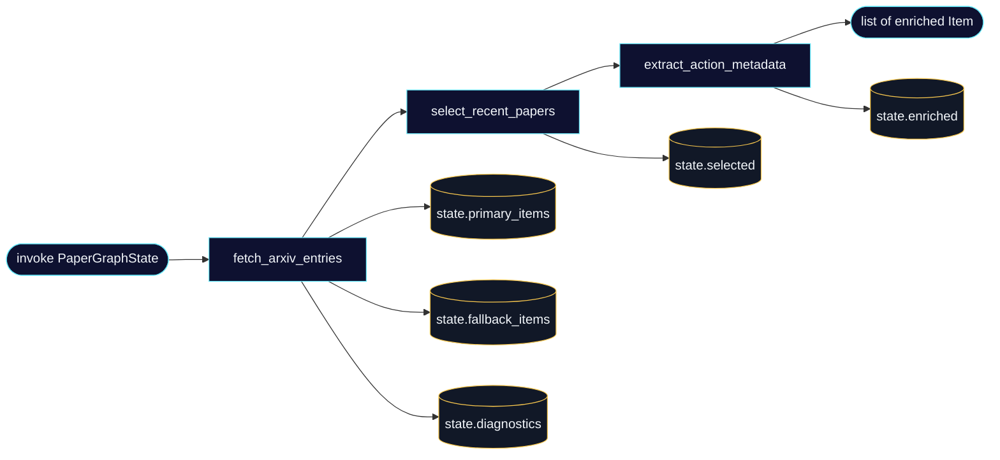
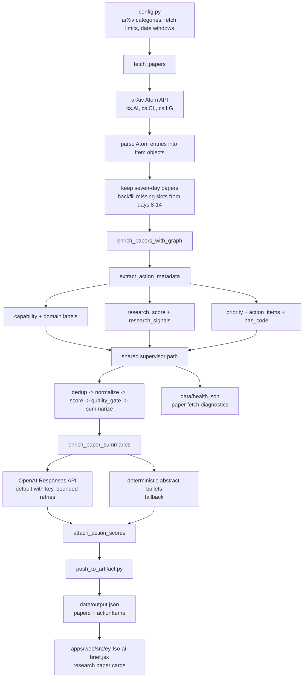
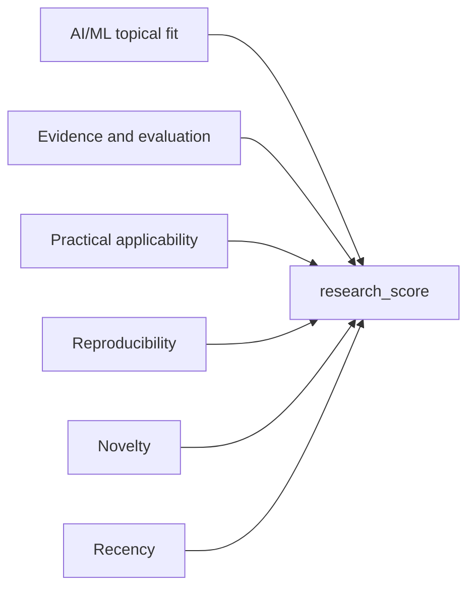
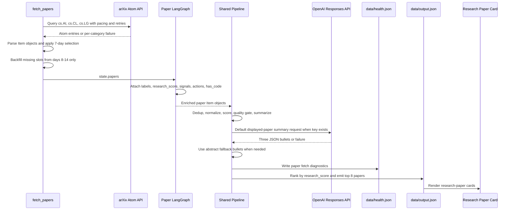

# Research Paper Agent Architecture

This page focuses only on the research-paper discovery and curation agent.

The agent answers one question for each weekly run:

> Which recent AI/ML research papers have the strongest evidence, applicability,
> reproducibility, novelty, and freshness signals for the weekly dashboard?

The paper workflow uses a three-node LangGraph for source extraction, freshness
selection, and deterministic metadata enrichment. Default OpenAI summaries and
artifact mapping remain explicit post-score pipeline stages:

```text
fetch_papers
  -> LangGraph(fetch_arxiv_entries -> select_recent_papers -> extract_action_metadata)
  -> shared pipeline processing
  -> default OpenAI summary bullets with deterministic fallback
  -> rank and write papers[] + paper-derived actionItems[]
```

The result is a compact `papers[]` payload plus a retained paper-derived
`actionItems[]` compatibility payload for the frontend.

## LangGraph Line Graph



The graph state carries collection, selection, enrichment, and diagnostic data:

```python
class PaperGraphState(TypedDict, total=False):
    categories: list[str]
    primary_items: list[Item]
    fallback_items: list[Item]
    selected: list[Item]
    enriched: list[Item]
    diagnostics: dict[str, Any]
```

If `langgraph` is unavailable, `_run_sequential_graph(...)` invokes the same
three stage functions directly. Output behavior remains the same.

## End-to-End Data Flow



## Source Configuration

Paper discovery configuration currently lives in
`apps/pipeline/src/news_pipeline/config.py`.

| Parameter | Default | Env var | Meaning |
| --- | ---: | --- | --- |
| `ARXIV_CATEGORIES` | `cs.AI`, `cs.CL`, `cs.LG` | - | arXiv category queries |
| `ARXIV_MAX_RESULTS_PER_CATEGORY` | `25` | `ARXIV_MAX_RESULTS_PER_CATEGORY` | maximum Atom entries requested per category |
| `DATE_WINDOW_DAYS` | `7` | `DATE_WINDOW_DAYS` | primary weekly freshness window |
| `ARXIV_FALLBACK_WINDOW_DAYS` | `14` | `ARXIV_FALLBACK_WINDOW_DAYS` | bounded backfill horizon when fewer than eight recent unique papers exist |
| `OPENAI_PAPER_SUMMARY_LIMIT` | `8` | `OPENAI_PAPER_SUMMARY_LIMIT` | maximum displayed-paper summary attempts per run |
| `OPENAI_PAPER_SUMMARY_MAX_RETRIES` | `2` | `OPENAI_PAPER_SUMMARY_MAX_RETRIES` | transient retries after the initial summary request |
| `ARXIV_MAX_RETRIES` | `2` | `ARXIV_MAX_RETRIES` | transient retries after the initial category request |
| `ARXIV_REQUEST_INTERVAL_SECONDS` | `3` | `ARXIV_REQUEST_INTERVAL_SECONDS` | minimum spacing between arXiv API requests |
| `OPENAI_MODEL` | `gpt-5.4-mini` | `OPENAI_MODEL` | model used for default paper-summary bullets |

Unlike the GitHub and model/tools agents, the paper workflow does not currently
have a dynamic source resolver or generated runtime source configuration. arXiv
categories are contributor-maintained static inputs.

## Stage 1: Fetch arXiv Entries

`fetch_papers()` queries each category independently:

```text
GET https://export.arxiv.org/api/query
  ?search_query=cat:{category}
  &start=0
  &max_results=25
  &sortBy=submittedDate
  &sortOrder=descending
```

Each Atom entry becomes a shared pipeline `Item`:

```python
Item(
    id=f"paper-{stable_hash(arxiv_url)}",
    source="arXiv",
    source_type="paper",
    title=normalized_title,
    url=pdf_url or arxiv_url,
    authors=authors or ["Unknown"],
    published_date=published,
    fetched_date=utc_now_iso(),
    raw_content=abstract,
    tags=arxiv_categories,
)
```

Extraction keeps:

- normalized title
- abstract text
- arXiv publication timestamp
- PDF URL when available
- authors
- arXiv category tags

### Partial Results and Failure Isolation

Each category request is isolated. A timeout, HTTP error, or malformed Atom
response for one category is captured in diagnostics and does not discard
successful categories.

Each arXiv request is spaced by at least three seconds. Transient failures retry
twice after the initial request with exponential backoff and jitter. Retryable
failures include timeouts, connection failures, malformed XML, HTTP `408`,
`425`, `429`, and `5xx`.

This matters for arXiv `429` responses: a rate-limited `cs.LG` request should
not erase valid `cs.AI` and `cs.CL` papers from the weekly brief.

## Stage 2: Freshness Selection and Backfill

The fetcher separates parsed papers into two pools:

1. **Primary pool:** papers published within `DATE_WINDOW_DAYS` (default `7`).
2. **Fallback pool:** papers older than the primary window but no older than
   `ARXIV_FALLBACK_WINDOW_DAYS` (default `14`).

Selection logic:

```python
selected = unique_primary_papers_by_url
if len(selected) < 8:
    append_unique_fallback_papers_until_eight
```

Important boundaries:

- Papers older than the fallback horizon are dropped.
- Primary papers are not capped at eight during fetch. The ranking stage still
  needs the full fresh candidate pool.
- Days 8-14 papers are used only to fill missing display slots.
- URL deduplication happens during this selection and again in the shared
  pipeline deduplicator.

## Stage 3: Deterministic Metadata Graph

`fetch_papers_with_graph(...)` passes the freshness-selected papers from
`select_recent_papers` into the final deterministic metadata node.

The node calls `enrich_paper_item(...)` for every paper and attaches:

```python
metadata = {
    "item_kind": "paper",
    "paper_signal_id": str,
    "capability": str,
    "domain": str,
    "priority": "READ" | "EXPERIMENT" | "SHARE" | "WATCH",
    "action_title": str,
    "action_items": list[str],
    "takeaways": list[str],
    "paper_tags": list[str],
    "research_score": int,
    "research_score_components": dict[str, int],
    "research_signals": dict[str, str],
    "has_code": bool,
}
```

### Capability and Domain Labels

The paper agent uses deterministic keyword matching across:

```text
title + abstract + arXiv category tags
```

Capability labels include:

- Agentic AI
- RAG and Knowledge Systems
- Foundation Models and Generative AI
- Reasoning and Planning
- Evaluation and Benchmarks
- Multimodal AI
- Training and Fine-Tuning
- Inference and Model Efficiency
- LLMOps and Production AI
- Safety, Alignment and Governance
- Data and Synthetic Data
- Classical ML and Predictive Modeling

Domain labels include:

- AI Engineering and Developer Tools
- Enterprise and Knowledge Work
- Security and Privacy
- Healthcare and Life Sciences
- Finance and Economics
- Robotics and Autonomous Systems
- Science and Research
- Education
- Media and Creative
- Public Sector and Legal
- Cross-domain

Labels use weighted phrase matching with word boundaries and overlap
suppression. More specific phrases outrank generic terms. Weak or tied domain
matches emit `Other` instead of forcing a misleading category. Domain labels
remain descriptive metadata; they do not filter or score papers.

## Research Score

The paper-card ranking score is deterministic and independent from the shared
mixed-source relevance score.



| Component | Max weight | Signal examples |
| --- | ---: | --- |
| `topical_fit` | `25` | AI, ML, LLM, agent, retrieval, transformer, multimodal, reasoning |
| `evidence` | `20` | benchmark, evaluation, experiment, dataset, ablation, baseline, results |
| `applicability` | `20` | implementation, framework, deployment, workflow, inference, serving |
| `reproducibility` | `15` | open source, code, GitHub, repository, dataset, implementation |
| `novelty` | `10` | novel, introduce, propose, first, state-of-the-art, emerging |
| `recency` | `10` | starts at `10` and declines by publication age in days |

Formula:

```python
research_score = sum(research_score_components.values())
```

The agent also converts four components into frontend-visible signal levels:

```python
research_signals = {
    "evidence": "Low" | "Medium" | "High",
    "applicability": "Low" | "Medium" | "High",
    "reproducibility": "Low" | "Medium" | "High",
    "novelty": "Low" | "Medium" | "High",
}
```

Signal thresholds are based on the component's share of its maximum:

- `High`: at least `67%`
- `Medium`: at least `34%`
- `Low`: below `34%`

## Priority, Action Items, and Code Signal

The metadata graph produces a deterministic action priority:

| Priority | Selection rule |
| --- | --- |
| `SHARE` | abstract contains broad-impact terms such as safety, governance, privacy, or security |
| `EXPERIMENT` | reproducibility is high or the paper has at least two applicability-term hits |
| `WATCH` | abstract contains early-stage terms such as survey, preliminary, or limitations |
| `READ` | default |

Each paper receives three action items:

1. priority-specific action title plus paper title
2. capability-to-domain assessment prompt
3. one pilot question and one risk question prompt

`has_code` is currently a heuristic. It becomes `true` when the paper text or
related links mention terms such as `github`, `code`, `open source`, or
`implementation`. It does not yet verify an explicit repository URL.

## Where OpenAI Is Used

OpenAI summaries are the default when `OPENAI_API_KEY` is configured and appear
at one point only: after deterministic metadata enrichment and shared
summarization, before final artifact mapping.

| LLM path | When it runs | Calls per paper run | What it does | What it does not do |
| --- | --- | ---: | --- | --- |
| Displayed-paper summary bullets | after ranking metadata exists | `0` to `8` papers; up to `24` HTTP requests with default retries | returns exactly three concise abstract-grounded bullets | does not fetch, filter, score, rank, or label papers |

### Why the LLM Call Exists

The deterministic graph can classify and rank a paper without OpenAI. The
default summary call improves the readability of the displayed paper card by turning
the title and abstract into three concise bullets covering:

1. contribution
2. evidence or method
3. practical implication

Input:

```json
{
  "title": "Paper title",
  "abstract": "Paper abstract",
  "capability": "Evaluation and Benchmarks",
  "domain": "AI Engineering and Developer Tools"
}
```

Expected JSON response:

```json
{
  "bullets": [
    "Contribution",
    "Evidence or method",
    "Practical implication"
  ]
}
```

### LLM Guardrails and Fallback

- If `OPENAI_API_KEY` is missing, the workflow uses deterministic fallback
  bullets.
- Transient request errors, retryable HTTP statuses, invalid JSON, and invalid
  three-bullet responses retry twice with exponential backoff and jitter.
- If retries are exhausted, the workflow uses deterministic fallback bullets.
- If an OpenAI request returns `401`, `403`, or `429 insufficient_quota`, later
  paper-summary calls are disabled for the rest of that process.
- The prompt requires bullets grounded only in the supplied title and abstract.
- The default cap is `OPENAI_PAPER_SUMMARY_LIMIT=8`, matching the maximum
  displayed paper cards.

Fallback logic:

1. Use the first three abstract sentences.
2. If fewer than three sentences exist, fill remaining slots with deterministic
   capability, domain, and review guidance.

This keeps paper discovery and ranking functional without an API key or API
quota.

## Shared Supervisor Integration

The research-paper workflow is one fetch agent inside the main supervisor
fan-out:

```python
FETCH_AGENTS = {
    "papers": fetch_papers,
    "github": fetch_github,
    "rss": fetch_rss,
    "model_tools": fetch_model_tools,
}
```

Full pipeline sequence:

1. `supervisor.py` runs fetch agents in parallel.
2. `fetch_papers()` returns freshness-selected, graph-enriched `Item` objects.
3. Shared processing applies:
   - `deduplicate_items(...)`
   - `normalize_items(...)`
   - `score_items(...)`
   - `apply_quality_gate(...)`
   - `summarize_items(...)`
4. `enrich_paper_summaries(...)` replaces deterministic graph takeaways for the
   highest-ranked bounded paper set with OpenAI bullets or abstract fallbacks.
5. `attach_action_scores(...)` adds a separate generic actionability score.
6. Supervisor adds paper fetch diagnostics to the `papers` health entry.
7. `push_to_artifact(...)` ranks and writes the dashboard payload.

### Three Different Scores

The paper path currently carries three scores with distinct responsibilities:

| Score | Owner | Purpose |
| --- | --- | --- |
| `research_score` | `paper_graph.py` | rank the visible research-paper cards |
| `action_score` | `score.py` | retain generic actionability metadata for paper-derived compatibility action items |
| shared `score` | `score.py` | participate in the full supervisor's shared quality-gate contract |

Do not collapse these into one generic score when tuning the paper agent. They
answer different questions.

## Paper-Only Refresh Path

Use:

```sh
npm run pipeline:papers
```

This invokes `news_pipeline.paper_pipeline` and refreshes paper-owned fields
without fetching or replacing the existing non-paper dashboard sections.

Paper-only sequence:

```text
fetch_papers
  -> deduplicate_items
  -> normalize_items
  -> summarize_items
  -> enrich_paper_summaries
  -> attach_action_scores
  -> update_papers_in_payload
  -> write data/output.json + data/health.json
```

The paper-only path intentionally preserves:

- `repos`
- `blogs`
- `models`
- `toolsServices`
- `socialPosts`
- `trending`

It updates:

- `generatedAt`
- `PAPERS SCANNED` stats tile
- `actionItems`
- `papers`
- `health`

## Artifact Mapping

`push_to_artifact.py` sorts papers by `metadata.research_score` descending and
emits the top eight:

```python
papers = [item for item in items if item.get("source_type") == "paper"]
papers.sort(
    key=lambda item: (item.get("metadata") or {}).get("research_score", 0),
    reverse=True,
)
```

Each selected paper is mapped through `_to_paper(...)`.

Frontend-facing paper shape:

```json
{
  "title": "Paper title",
  "authors": "A. Researcher, B. Researcher",
  "org": "arXiv",
  "date": "Jun 1, 2026",
  "hasCode": true,
  "researchScore": 78,
  "priority": "EXPERIMENT",
  "tags": ["Evaluation and Benchmarks", "AI Engineering and Developer Tools"],
  "abstract": "Full normalized abstract",
  "takeaways": ["...", "...", "..."],
  "actionItems": ["...", "...", "..."],
  "researchSignals": {
    "evidence": "High",
    "applicability": "Medium",
    "reproducibility": "Medium",
    "novelty": "High"
  },
  "capability": "Evaluation and Benchmarks",
  "domain": "AI Engineering and Developer Tools",
  "url": "https://arxiv.org/pdf/..."
}
```

The retained `actionItems[]` compatibility field is also paper-only. It maps
the top five ranked papers through `_to_action_item(...)`; GitHub, RSS, model,
and tool/service items do not compete for those slots.

## Diagnostics and Health Output

Supervisor writes paper diagnostics into `data/health.json` under
`source = "papers"`.

Current diagnostic shape:

```python
{
    "source": "papers",
    "status": "ok",
    "item_count": int,
    "duration_ms": int,
    "fetch_diagnostics": {
        "categories": [
            {
                "category": "cs.AI",
                "status": "ok" | "error",
                "raw_count": int,
                "seven_day_count": int,
                "fourteen_day_count": int,
                "error": str,  # only on failure
            }
        ],
        "raw_count": int,
        "seven_day_count": int,
        "fourteen_day_count": int,
        "backfill_count": int,
        "selected_window_days": 7 | 14,
        "deduplicated_count": int,
        "displayed_count": int,
        "request_attempts": int,
        "retry_count": int,
        "summary_diagnostics": {
            "attempted_papers": int,
            "request_attempts": int,
            "retry_count": int,
            "successes": int,
            "fallbacks": int,
            "disabled": bool,
            "skip_reason": str,
        },
    },
}
```

This is the main place to inspect why paper-card volume changed across weekly
runs.

## Failure Modes and Guardrails

| Failure mode | Handling |
| --- | --- |
| One arXiv category returns `429`, times out, or returns malformed XML | retry twice, then preserve successful categories and record the category error |
| Fewer than eight unique papers exist in the seven-day window | backfill only missing slots from days 8-14 |
| Duplicate paper appears across arXiv categories | deduplicate by URL |
| `langgraph` is unavailable | run the same metadata extraction function sequentially |
| OpenAI key is missing | use deterministic abstract-grounded bullets |
| OpenAI returns invalid JSON or a transient request error | retry twice, then use deterministic abstract-grounded bullets |
| OpenAI returns `401`, `403`, or `429 insufficient_quota` | disable later paper-summary calls for the rest of the process |
| Paper mentions code without an explicit repository URL | expose heuristic `hasCode`; improve explicit link extraction before treating it as verified |

## End-to-End Research Paper Sequence



## Tuning Points

| Setting or code area | Why change it |
| --- | --- |
| `ARXIV_CATEGORIES` | adjust AI/ML source coverage |
| `ARXIV_MAX_RESULTS_PER_CATEGORY` | widen or reduce per-category candidate breadth |
| `DATE_WINDOW_DAYS` | expand or narrow the primary weekly freshness window |
| `ARXIV_FALLBACK_WINDOW_DAYS` | expand or narrow bounded backfill |
| `ARXIV_MAX_RETRIES` | control transient arXiv retry exposure |
| `ARXIV_REQUEST_INTERVAL_SECONDS` | tune arXiv request pacing |
| capability keyword groups | improve descriptive capability labels |
| domain keyword groups | improve descriptive domain labels |
| research-score term groups and weights | tune visible paper ranking |
| priority term groups | tune `READ`, `EXPERIMENT`, `SHARE`, and `WATCH` assignment |
| `OPENAI_PAPER_SUMMARY_LIMIT` | control optional summary cost and rate-limit exposure |
| `OPENAI_PAPER_SUMMARY_MAX_RETRIES` | control transient summary retry exposure |
| `has_code` heuristic | replace text-signal inference with explicit repository-link extraction |

## Current Design Choice

The paper agent is deterministic-first. Fetching, freshness selection, labels,
research scoring, priority assignment, action items, and final ranking do not
depend on OpenAI. The default LLM call improves the readability of visible
paper bullets when a key is available, while deterministic fallback bullets
keep the selection logic resilient and inspectable.
